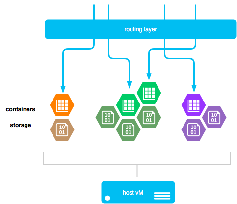

HomePort
========

HomePort is an attempt to build small reusable components for
deploying safe, secure and stable services that one might want to
run for personal use, like mail / web / shell.

This is a very young project, born out of a necessity to manage
and upgrade an existing personal services environment, and a
desire to bring best practices and real-world expertise to bear on
this problem, for the good of humanity.

Also, being bored is the worst.

This project is _very alpha_; use it at your own risk.  If it
break, you get to keep both pieces.

Architecture
------------

Currently, we are targeting Docker (and Linux cgroups) as a
packaging and delivery format.  Each 'port will be managed as a
single Docker image, with configuration via environment variables,
disk files, etc.

It looks a bit like this:

Containers are ephemeral, and should not be able to hold any
persistent data in their own images.  Instead, any service that
needs to manage data (and lets face it, most do) will need to
mount a volume into its namespace, so that the data survives
image reboots, updates, and outages.

A shared routing layer will connect external ports ("public"
ports) to ports running on individual container images.  This may
be `haproxy`, or it may be as simple as `iptables` with some
forwarding rules.

'Port images may need to take advantage of shared services that
are often present in UNIX environments, like `cron` or `syslog`.
These will have to be run outside of any given container, on the
host machine, and properly wired in, either via filesystem views
(for crontabs) or by more advanced IPC mechanisms or networking
(i.e. syslog on loopback TCP/514).

Concerns
--------

We must keep the following concerns in mind while designing and
implementing this system:

  1. Deploying images should be easy
  2. User data must be preserved
  3. The upgrade process shoud be simple
  4. External 'port images are acceptable, and desired

### Deploying Images Should Be Easy

Users should be able to deploy images quickly and easily.

This not only means that the tooling for HomePort must be
straightforward, but also that containers themselves should fail
noisily if they are missing configuration information, cannot
write to volumes, or for whatever reason are internally
inconsistent (and therefore unfit for production use).

Users should **not** have to try to "guess" why the container is
failing, nor should they be lead to believe that a non-working
configuration has succeeded.

### User Data Must Be Preserved

User data is the most important part of this system.  Spinning a
new copy of a 'port must ensure that it does not delete or corrupt
data without explicit approval from the user.

I don't want to lose all my mail because the next version of the
postfix 'port thinks that Maildir is better than mbox, or because
the data directory was incorrectly mounted.

Without this base level of trust with the users, the whole idea of
HomePort falls apart.

### The Upgrade Process Should Be Simple

One of the primary goals of HomePort is not only to get you up and
running with commonly-run services like web and email, but also to
make it dead simple to migrate to the next version of a given
'port, either for security or functionality reasons.

Partially, this means that 'port images shouldn't vary wildly in
configuration from one release to the next, at least not without
breaking off a new 'port name.

Corolary to this is that 'ports should be downgrade-able (within
reason), in case that new functionality isn't all it's cracked up
to be.

### External 'Port Images Are Acceptable / Desired

The toolkit for building a new 'port should be as simple as it can
be, and the interface / protocol of a 'port must be
well-documented.

This will allow others to build on the HomePort system and provide
their own 'ports, either as variations on base images (email, but
with a webmail component) or completely new service offerings.

Proof-of-Concept
----------------

To get this project off the ground, we need to build a small
proof-of-concept 'port: shell.  It should exercise all of the
components of the architecture quite well:

  - persistent data for `$HOME`
  - routing a random port to SSH in
  - process scheduling (respawn shell when it dies)
  - configuration (bash or zsh?)

Roadmap
-------

We hope to be able to provide these baseline 'ports:

  - **web** - For serving static websites.
  - **email** - An SMTP submission endpoint, with IMAP/POP access.
  - **shell** - Simple, isolated shell env with SSH

